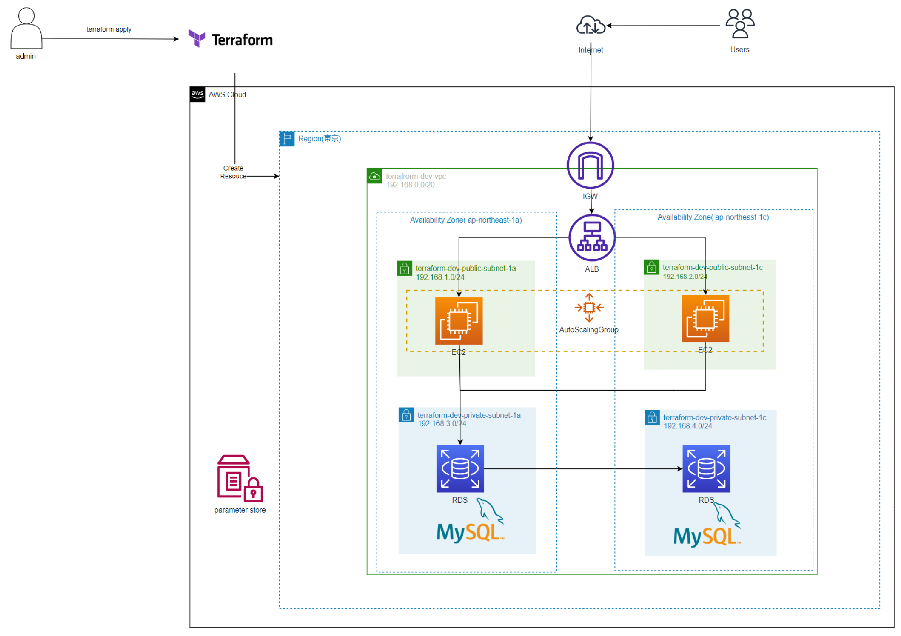

# Terraformを使用したリソースの作成
## 概要  
- Terraformを使用して可用性を意識したAWSリソースを作成する。
### テンプレートの説明 （使用サービス）
- appserver.tf・・AutoScalingの起動テンプレート、AutoScalingグループ、ポリシー、Parameter Store、keypairの登録
- data.tf・・AMI情報  
- rds.tf・・RDSの設定
- elb.tf・・ALBの設定、ターゲットグループの設定  
- iam.tf・・IAMポリシー、プロファイル情報  
- main.tf・・使用するTerraformのバージョンを指定  
- network.tf・・VPC、サブネットの設定情報  
- securty_group.tf・・セキュリティーグループの設定  
- terraform.tfvars・・環境変数の設定  

## AWS構成図  
